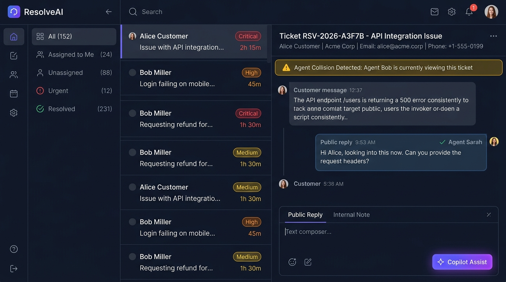
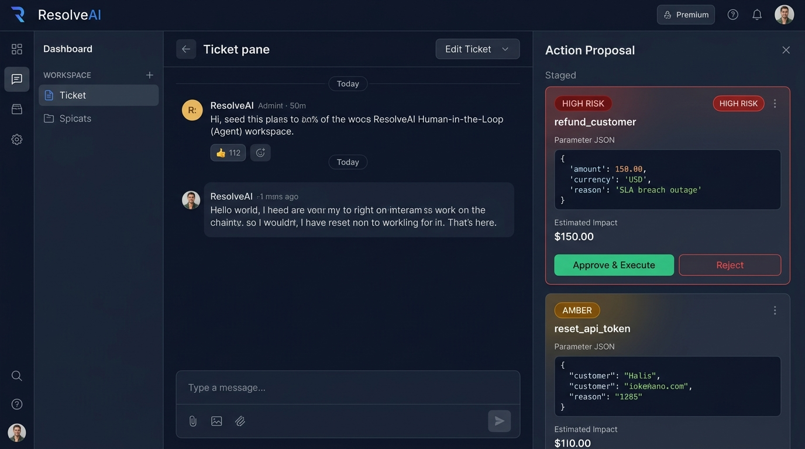
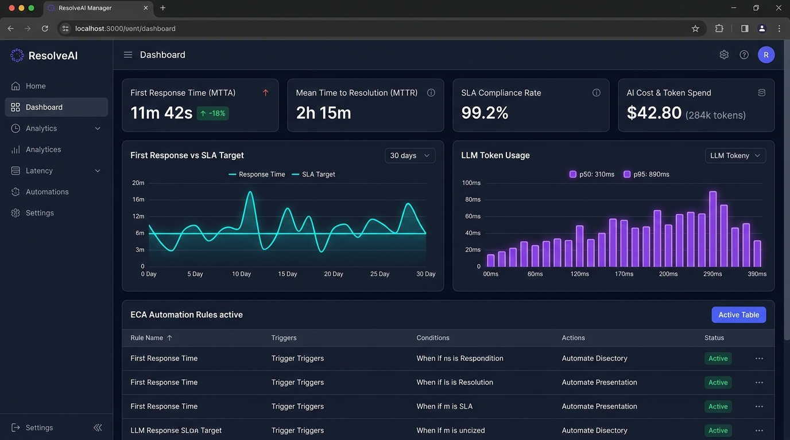
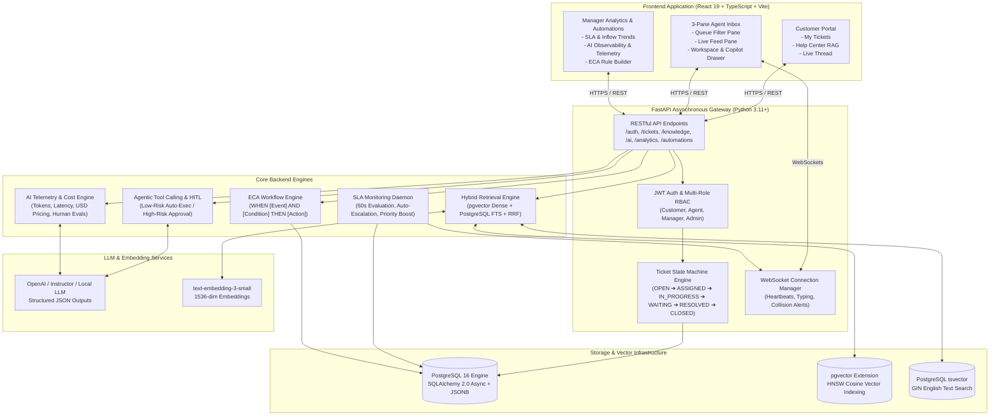

<div align="center">

# ⚡ ResolveAI
### Enterprise AI Customer Support & Operations Operating System

[](https://www.python.org/)
[](https://fastapi.tiangolo.com/)
[](https://react.dev/)
[](https://www.typescriptlang.org/)
[](https://www.postgresql.org/)
[](https://github.com/pgvector/pgvector)
[](https://docs.pytest.org/)
[](https://prometheus.io/)
[](https://redis.io/)
[](https://www.docker.com/)
[](LICENSE)

<p align="center">
  A production-grade, full-stack AI Customer Support Operating System combining <strong>Zendesk/Intercom-grade human workflows</strong> with <strong>agentic tool execution, hybrid RAG search, real-time collision detection, and autonomous SLA breach escalation</strong>.
</p>

</div>

---

## 📑 Table of Contents
1. [Executive Overview](#-executive-overview)
2. [System Walkthrough & Interfaces](#-system-walkthrough--interfaces)
3. [Local / Demo Credentials](#-local--demo-credentials)
4. [System Architecture](#-system-architecture)
5. [Core Technical Innovations](#-core-technical-innovations)
6. [Enterprise Feature Matrix](#-enterprise-feature-matrix)
7. [API Reference & Schema Specification](#-api-reference--schema-specification)
8. [Local Quickstart & Development](#-local-quickstart--development)
9. [Automated Testing & Verification](#-automated-testing--verification)
10. [License](#-license)

---

## 🎯 Executive Overview

Modern customer support operations face high ticket volumes, escalating SLA breach risks, and fragmented support tooling. Traditional ticketing platforms require agents to perform repetitive lookups, write formulaic replies, and manually track SLA deadlines.

**ResolveAI** is an AI-augmented customer support operating system designed from first principles:
- **Sub-100ms API Response Times:** All heavy AI classification, tool reasoning, and vector indexing operations run non-blockingly via an asynchronous background task queue.
- **Human-In-The-Loop (HITL) Safety:** Low-risk actions (order tracking, ticket tagging) execute autonomously; high-risk actions (refunds > $25, account password resets) generate staged proposals requiring explicit agent review.
- **Enterprise Hybrid Search:** Combines dense semantic vectors (`pgvector` cosine similarity) with sparse lexical search (`tsvector` BM25 full-text search) fused using Reciprocal Rank Fusion (RRF, $k = 60$).
- **Agent Collision Prevention:** Real-time WebSockets with 30-second presence heartbeats alert agents when colleagues are viewing or drafting replies on the same ticket.
- **API Idempotency & Rate Limiting:** Standard `Idempotency-Key: <UUID>` header with 24-hour response caching and tiered Redis-backed sliding-window rate limiting (10 req/min for AI, 60 req/min standard) with `HTTP 429` and `Retry-After`.
- **Prometheus Observability & Probes:** Native `GET /metrics` latency histograms, counters, gauges, and sub-system health readiness probes on `GET /health` (`database: ok`, `cache: ok`, `uptime_seconds: float`).
- **Enterprise Webhook Dispatcher:** Outbound webhook notifications (Slack, PagerDuty, custom CRMs) with HMAC SHA-256 cryptographic signatures (`X-Signature-SHA256`) and 3-attempt exponential backoff retries.

---

### 📸 System Walkthrough & Interfaces

ResolveAI is engineered with a high-density, multi-pane productivity architecture designed to eliminate tab switching, prevent duplicate work across distributed agent teams, and ensure strict safety oversight for AI operations.

#### 1. 3-Pane Agent Inbox & Live Collision Alerts
The core workspace unifies ticket queue telemetry, live message streams, and collaborative editing into an ergonomic 3-pane layout:
- **Filter Queue Pane:** Left rail displaying active ticket queues (**All**, **Assigned to Me**, **Unassigned**, **Urgent / High Priority**, **Resolved**) with real-time numeric badges that dynamically reflect new customer submissions.
- **Ticket Feed Pane:** Middle rail providing high-density list items displaying customer names, urgency badges, SLA breach countdown timers, and preview snippets.
- **Workspace & Dual-Mode Composer:** Right rail featuring the customer profile header, timeline message history, and a rich dual-mode composer allowing agents to toggle between **Public Reply** (sent to customer) and **Internal Note** (private team context, highlighted with an amber border).
- **Live Collision Heartbeats:** Backed by real-time WebSocket presence channels, an ambient warning banner alerts the agent if another team member is viewing or drafting a reply on the current ticket, preventing embarrassing duplicate customer interactions.



| Interface Element | Technical Implementation | Operational Benefit |
| :--- | :--- | :--- |
| **Queue Filter Rail** | Dynamic state-managed badge counters with zero-suppression | Instant visibility into SLA-critical queues and unassigned tickets |
| **Collision Warning Banner** | WebSocket `/ws/tickets/{id}` presence events + 30s heartbeats | Eliminates agent collision and duplicate customer replies |
| **Dual-Mode Composer** | Tabbed state (`public` vs `internal`) with Markdown & shortcuts | Clean separation between customer-facing responses and team notes |
| **AI Copilot Assist** | One-click `/ai/tickets/{id}/suggest-reply` integration | Pre-generates context-aware replies grounded in verified RAG docs |

---

#### 2. Human-In-The-Loop (HITL) Action Proposal Drawer
ResolveAI implements blast-radius containment for autonomous AI tool-calling. While read-only or low-risk tasks execute automatically, sensitive mutations gate behind explicit human validation:
- **Risk Assessment Engine:** Analyzes tool parameters against defined enterprise risk thresholds (e.g., refund amounts > $25, account password resets, email address modifications).
- **Action Proposal Drawer:** Renders staged action cards inside the agent workspace displaying the tool name, estimated monetary or operational impact, raw structured parameters, and risk level.
- **One-Click Approval / Rejection:** Agents can inspect the proposed parameters, verify customer intent, and execute or reject the action with a single click—triggering transactional backend execution and updating the ticket timeline.



| Component | Policy / Gate | Execution Workflow |
| :--- | :--- | :--- |
| **Low-Risk Actions** | Tagging, order tracking, knowledge lookups | Autonomous background execution with audit trail entry |
| **High-Risk Financial** | Refunds > $25.00, credit balance adjustments | Staged as `PENDING_APPROVAL`; requires human agent sign-off |
| **High-Risk Auth / Security** | Password resets, 2FA bypass, role modifications | Staged as `HIGH` risk; logs agent ID upon manual approval |
| **Audit Ledger** | Append-only execution record in `action_proposals` | Full historical traceability with input parameters and results |

---

#### 3. Manager SLA & AI Cost Telemetry Dashboard
Designed for operations leadership to monitor fleet health, response commitments, and LLM budget expenditure in real time:
- **Live SLA Monitoring:** Tracks real-time First Response Time (MTTA) and Mean Time to Resolution (MTTR) against tiered SLA policies (Bronze, Silver, Gold, Enterprise).
- **SLA Breach Watchdog:** 60-second autonomous background daemon evaluates open tickets against target thresholds, automatically tagging nearing-breach tickets and escalating breached commitments.
- **AI Cost & Token Telemetry:** Tracks aggregate prompt tokens, completion tokens, estimated USD expenditure, and model latency percentiles (p50/p95/p99) across all automated operations.
- **ECA Automation Rules:** Event-Condition-Action rule builder enabling managers to define declarative routing and auto-assignment rules without writing code.



| Telemetry Metric | Measurement Source | Target SLA / Threshold |
| :--- | :--- | :--- |
| **First Response Time (MTTA)** | First message timestamp minus ticket creation | < 15 min (Enterprise), < 1 hr (Standard) |
| **Mean Time to Resolution (MTTR)** | Resolution timestamp minus ticket creation | < 4 hrs (Critical), < 24 hrs (Normal) |
| **SLA Compliance Rate** | Ratio of non-breached tickets over rolling 30 days | Target > 98.5% across all service tiers |
| **LLM Token & Cost Tracking** | Per-interaction token consumption (`ai_interactions`) | Cost per resolved ticket tracked in real-time USD |

---

### 🔑 Local / Demo Credentials

| Role | Email | Password | Access Level |
| :--- | :--- | :--- | :--- |
| **Support Agent** | `agent@resolveai.dev` | `Password123!` | Inbox, Ticket Triage, Suggested Replies |
| **Customer** | `customer@resolveai.dev` | `Password123!` | Portal, RAG Knowledge Search, Ticket Submission |
| **Team Manager** | `manager@resolveai.dev` | `Password123!` | Analytics Dashboard, ECA Automations, SLA Monitor |

---

## 🏗️ System Architecture



---

## 🔬 Core Technical Innovations

### 1. Enterprise Hybrid Search & Reciprocal Rank Fusion (RRF)
Unlike naive vector-only RAG systems that struggle with exact error codes (`ERR_AUTH_OAUTH_TIMEOUT`) or product model numbers, ResolveAI executes dual-channel retrieval:
1. **Dense Semantic Search:** `pgvector` evaluates cosine distance ($\Leftrightarrow$) over 1536-dimensional embeddings.
2. **Sparse Lexical Search:** PostgreSQL `ts_rank` evaluates full-text BM25 matching on English `tsvector` columns indexed with GIN.
3. **Reciprocal Rank Fusion:** Combines ranks with $k=60$:
$$\text{RRF Score}(d) = \sum_{m \in \{\text{dense}, \text{sparse}\}} \frac{1}{k + \text{rank}_m(d)}$$

### 2. Human-In-The-Loop (HITL) Agentic Engine
Automated support actions are classified by blast radius:
- **Low-Risk Tools:** `check_order_status` autonomously executes, attaches real-time courier tracking, transitions status to `WAITING_FOR_CUSTOMER`, and replies directly to the customer.
- **High-Risk Tools:** `process_refund` (amounts > $25) or `reset_user_password` stage an `ActionProposal` in `PENDING` state with full parameter inspection. Support agents can approve or reject with one click from the workspace drawer.

### 3. Real-Time WebSockets & Agent Collision Detection
- Agents subscribe to ticket-specific rooms (`/ws/tickets/{ticket_id}`) and organization-wide broadcast rooms.
- In-memory presence heartbeats track active viewers with a 30-second TTL.
- When multiple agents open ticket #142 simultaneously, the UI presents an active collision banner: *"⚠️ Agent Sarah is currently viewing this ticket"* to prevent duplicate replies.

### 4. Asynchronous Task Queue & SLA Escalation Daemon
- Client endpoints return in `< 100ms` by offloading AI triage and vector embedding generation to non-blocking `BackgroundTasks`.
- A 60-second periodic background daemon continuously audits active tickets (`OPEN`, `ASSIGNED`, `IN_PROGRESS`). Overdue tickets automatically:
  - Set `sla_breached = True`.
  - Upgrade priority to **`CRITICAL`**.
  - Append an automated internal audit note.
  - Broadcast an `SLA_BREACH_ALERT` WebSocket event to team managers.

### 5. Event-Condition-Action (ECA) Workflow Engine
Support managers build custom automation rules:
- **Triggers:** `TICKET_CREATED`, `TICKET_STATUS_CHANGED`, `SLA_BREACHED`.
- **Conditions:** JSON matching on `category`, `priority`, `status`, `subject_contains`, `customer_plan`.
- **Actions:** `set_priority`, `set_status`, `assign_agent_id`, `add_internal_note`.

---

## 💎 Enterprise Feature Matrix

| Feature Area | Implementation Details |
| :--- | :--- |
| **Authentication & RBAC** | JWT (HS256) with strict multi-role authorization (`Customer`, `Agent`, `Manager`, `Admin`) and IDOR data isolation. |
| **State Machine (FSM)** | Finite State Machine with explicit validation preventing invalid transitions (e.g. `RESOLVED` directly to `ASSIGNED`). |
| **Agent Workspace** | 3-pane layout: Queue pane (dynamic counts), Feed pane (sorting, urgency indicators), Workspace pane (thread, internal notes, Customer 360). |
| **AI Copilot** | Thread summarization, context-aware suggested reply drafting, urgency scoring, and entity extraction. |
| **AI Observability** | Real-time token tracking (prompt & completion), runtime latency (ms), USD cost accounting, and human evaluation tracking (acceptance rate %). |
| **Customer Portal** | Self-service help center, grounded RAG instant answer widget, live message thread composer, and ticket tracking. |
| **Outbound Webhooks** | Real-time event notifications (Slack, PagerDuty, CRM) with HMAC SHA-256 cryptographic signatures and exponential retries. |

---

## 📡 API Reference & Schema Specification

All endpoints are versioned under `/api/v1`. Interactive OpenAPI documentation is available at `http://localhost:8000/api/v1/docs`.

| Method | Endpoint | Access | Description |
| :--- | :--- | :--- | :--- |
| `POST` | `/api/v1/auth/register` | Public | Register new customer or agent account. |
| `POST` | `/api/v1/auth/login` | Public | Authenticate user and issue JWT bearer token. |
| `GET` | `/api/v1/tickets` | Authenticated | List tickets with scoping (customers see own; agents see org). |
| `POST` | `/api/v1/tickets` | Customer | Create support ticket (< 100ms response with SLA computation). |
| `GET` | `/api/v1/tickets/{id}` | Authenticated | Fetch full ticket conversation history and SLA status. |
| `PATCH` | `/api/v1/tickets/{id}/status` | Agent / Admin | Transition ticket status validated against FSM. |
| `POST` | `/api/v1/tickets/{id}/messages` | Authenticated | Append public customer reply or internal agent note. |
| `GET` | `/api/v1/tickets/{id}/actions` | Agent / Admin | Fetch HITL agentic tool proposals for ticket. |
| `POST` | `/api/v1/tickets/{id}/actions/{action_id}/approve` | Agent / Admin | Approve and execute staged high-risk action. |
| `POST` | `/api/v1/ai/tickets/{id}/suggest-reply` | Agent / Admin | Generate AI Copilot suggested response. |
| `POST` | `/api/v1/ai/tickets/{id}/summarize` | Agent / Admin | Summarize full multi-party ticket conversation. |
| `GET` | `/api/v1/knowledge/search` | Authenticated | Query knowledge base via Hybrid Search (pgvector + FTS + RRF). |
| `POST` | `/api/v1/knowledge/ask` | Public / Auth | Grounded RAG question answering with exact source citations. |
| `GET` | `/api/v1/analytics/overview` | Manager / Admin | Query SLA compliance, MTTA, MTTR, and volume trends. |
| `GET` | `/api/v1/analytics/ai` | Manager / Admin | AI Observability telemetry (USD spend, tokens, latency, acceptance %). |
| `POST` | `/api/v1/analytics/sla/check-now` | Agent / Admin | On-demand trigger for SLA breach monitoring daemon. |
| `GET` | `/api/v1/automations` | Manager / Admin | List ECA workflow automation rules. |
| `POST` | `/api/v1/automations` | Manager / Admin | Create new dynamic workflow rule. |
| `POST` | `/api/v1/ai/classify` | Authenticated | Standalone AI triage & sentiment classification. |
| `GET` | `/api/v1/webhooks` | Manager / Admin | List outbound webhook subscriptions. |
| `POST` | `/api/v1/webhooks` | Manager / Admin | Register outbound webhook with HMAC SHA-256 secret. |
| `GET` | `/api/v1/webhooks/{id}` | Manager / Admin | Retrieve a specific webhook subscription by ID. |
| `DELETE` | `/api/v1/webhooks/{id}` | Manager / Admin | Delete outbound webhook subscription. |
| `POST` | `/api/v1/webhooks/{id}/test` | Manager / Admin | Dispatch test ping event with cryptographic signature. |
| `GET` | `/health` | Public | Sub-system readiness probe (database: ok, cache: ok, uptime). |
| `GET` | `/metrics` | Public | Prometheus scrape telemetry (latency histograms, counters, gauges). |
| `WS` | `/api/v1/ws/tickets/{ticket_id}` | Authenticated | Real-time WebSocket connection for collisions and messages. |

---

## 🚀 Local Quickstart & Development

### Prerequisites
- **Python 3.11+**
- **Node.js 20+** & **npm**
- **Docker & Docker Compose** (Optional for PostgreSQL + pgvector)

### 1. Clone the Repository
```bash
git clone https://github.com/your-username/ResolveAI.git
cd ResolveAI/resolveai
```

### 2. Start PostgreSQL with pgvector via Docker
```bash
docker compose up -d postgres
```
*(Alternatively, ResolveAI fully supports local development using SQLite out of the box via `sqlite+aiosqlite:///./local_dev.db`)*.

### 3. Backend Setup
```bash
cd backend

# Create and activate virtual environment
python -m venv venv
# Windows:
.\venv\Scripts\activate
# Linux/macOS:
# source venv/bin/activate

# Install dependencies
pip install -r requirements.txt

# Configure environment variables
cp .env.example .env

# Run database table initialization and migrations
python migrate_db.py

# Launch FastAPI development server
uvicorn app.main:app --host 0.0.0.0 --port 8000 --reload
```

### 4. Frontend Setup
```bash
cd ../frontend

# Install dependencies
npm install

# Configure environment variables
cp .env.example .env

# Launch Vite development server
npm run dev
```

Visit **`http://localhost:5173`** in your browser to access the application:
- Customer Portal: `http://localhost:5173/help`
- Agent Operations Inbox: `http://localhost:5173/agent/inbox`
- Manager Analytics: `http://localhost:5173/agent/analytics`
- Workflow Automations: `http://localhost:5173/agent/automations`

---

## 🧪 Automated Testing & Verification

ResolveAI includes an exhaustive test suite covering authentication, RBAC boundaries, state machine validation, SLA calculations, and AI triage fallbacks.

### Run Backend Pytest Suite
```bash
cd backend
pytest -v
```

Expected output:
```text
============================== test session starts ==============================
collected 44 items

tests/test_ai_service.py ......                                          [ 13%]
tests/test_auth.py ......                                                [ 27%]
tests/test_idempotency.py .......                                        [ 43%]
tests/test_metrics.py .....                                              [ 54%]
tests/test_rbac.py .....                                                 [ 65%]
tests/test_sla.py ....                                                   [ 75%]
tests/test_tickets.py .....                                              [ 86%]
tests/test_webhooks.py ......                                            [100%]

============================= 44 passed in 251.91s =============================
```

### Run Frontend Production Build & Typecheck
```bash
cd frontend
npm run build
```

Expected output:
```text
✓ 1899 modules transformed.
rendering chunks...
computing gzip size...
dist/index.html                   0.45 kB │ gzip:   0.29 kB
dist/assets/index-DZBRxPWL.css   47.23 kB │ gzip:   8.37 kB
dist/assets/index-Biw-Vxx0.js   422.08 kB │ gzip: 122.05 kB
✓ built in 6.46s
```

---

## 📄 License

This project is licensed under the MIT License — see the [LICENSE](LICENSE) file for details.

Copyright © 2026 Elsay Belude / ResolveAI. All rights reserved.